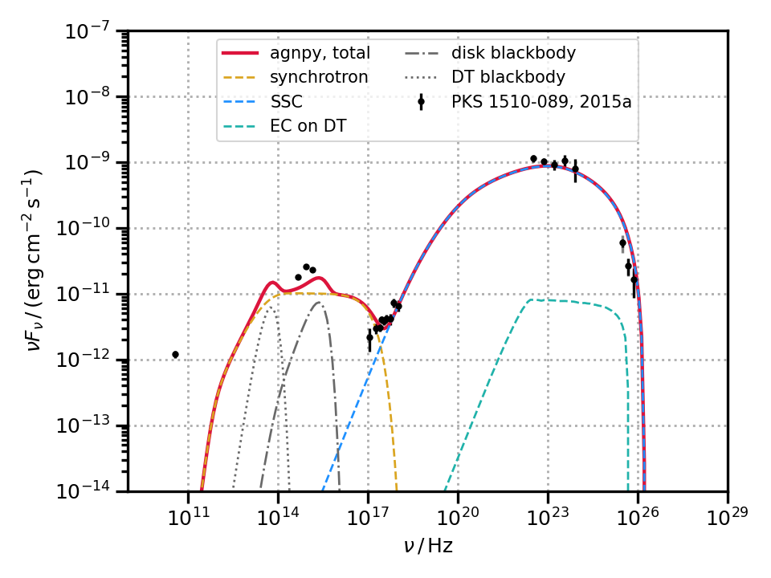
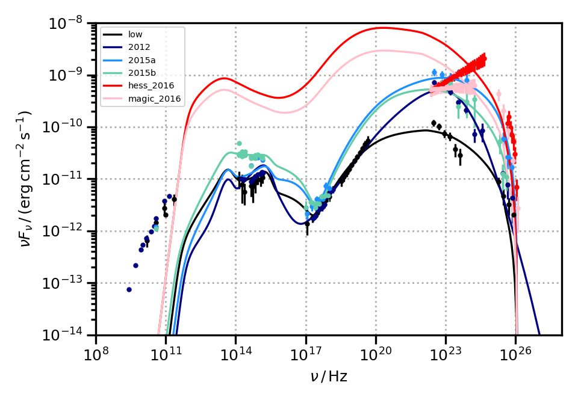

# PKS1510_modelling
Code using `agnpy` for the modelling the FSRQ PKS 1510-1019

## Basic usage
Basic functionalities are wrapped via [click](https://click.palletsprojects.com/en/8.0.x/).
Two commands are available 

## Environment
Added an environment installing all the dependencies needed to run the analysis.
```shell
conda env create -f environment.yml
```
a `pks1510-modelling` `conda` environment will be created. To activate it:
```shell
source activate pks1510-modelling
```

### fitting
You can fit a particulare state via the command
```shell 
$ python make.py fit
```
Pass the options `--help` when in doubt
```shell
$ python make.py fit --help
Usage: make.py fit [OPTIONS]

  Perform the fit of PKS 1510-089 SED for a given state

Options:
  --state [low|2012|2015a|2015b|hess_2016|magic_2016]
  --k_e FLOAT                     electron normalisation
  --gamma_min FLOAT               minimum Lorentz factor
  --gamma_max FLOAT               maximum Lorentz factor
  --t_var FLOAT                   variability time scale
  --r FLOAT                       distance of blob from BH
  --help                          Show this message and exit.
```

So, to perform the fit of the 2012 state adjusting some of the initial parameters (the ones specified in the help command)
```shell
python make.py fit --state 2012 --k_e 0.01 --gamma_min 3 --gamma_max 7e4
```
in the directory `results` a directory per each state will be created, containing the plot of the fitted SED and a dicitonary, a `.yaml` file, containing all the model parameters.

### Plotting
After performing the fit, SED and best-fit model can be plotted via the command
```shell
$ python make.py plot --state 2015a
```
you should obtain a plot like this


To plot all the SED together, use
```shell
$ python make.py plot --state all
```
you should obtain a plot like this

